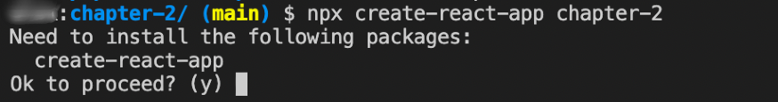
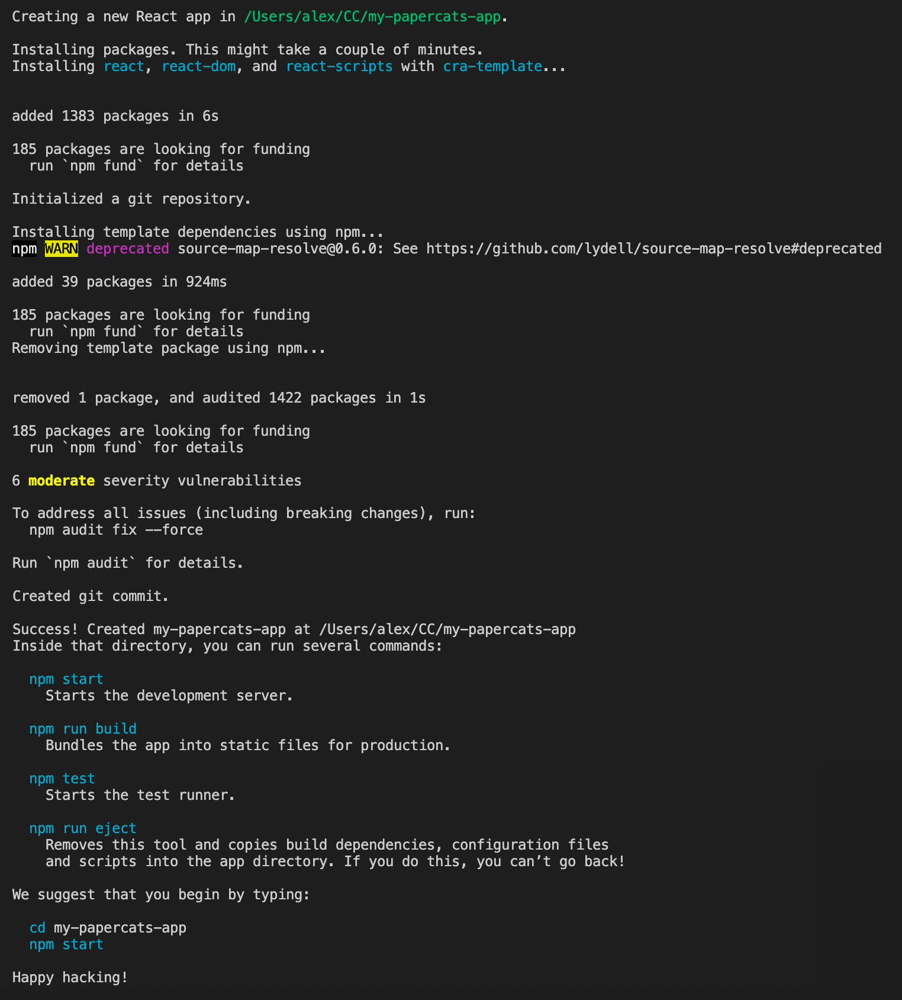
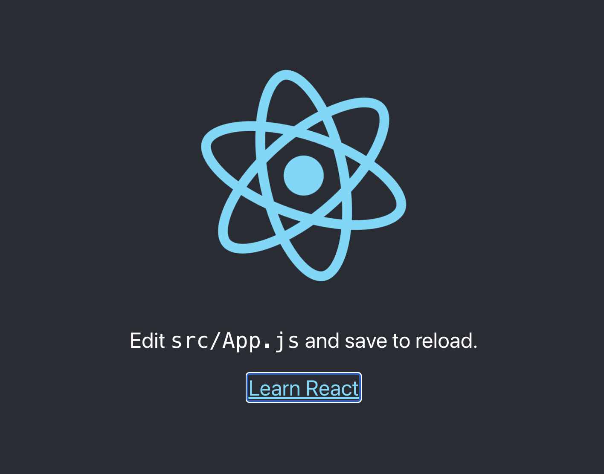

# Creating your Project
Welcome to Chapter 2!

In this chapter we are going to be walking through starting your project with the `create-react-app` toolchain.  This is perfect for creating a Single Page Application (SPA).  The [official documentation](https://reactjs.org/docs/create-a-new-react-app.html) has this to say:

> It sets up your development environment so that you can use the latest JavaScript features, provides a nice developer experience, and optimizes your app for production. 

So, in essence we get a lot of the hard work necessary for creating a SPA application done for us in a nicely abstracted package.

Before we start any coding, we are going to be using the `npx` or _node package executable_ command to run the `create-react-app` binary.  `Npx` is useful because it will also ask to install the package if it is missing from your system.  To read more about `npx`, [this article](https://medium.com/@maybekatz/introducing-npx-an-npm-package-runner-55f7d4bd282b) provides a nice primer into its role within the node ecosystem.

## Lets get started!
To start your project, open up a command line terminal and navigate to the location where you want to store this repository.  

In the command line type the following:

```npx create-react-app my-papercats-app```

What we are doing here is calling `npx` with two parameters, `create-react-app` (the excutable we want to run) and `my-papercats-app` the target folder of the `create-react-app` application.

If this is the first time you are running the `create-react-app` binary you may get the following message:



This is asking you to confirm to install this missing executable which we want to do, so press `Y` to continue.

Your system should now start to download `create-react-app` and continue after that to install your new project.  You will eventually be greeted by the following message:



This is a lot of information!  Some of it may not be present on your system but lets break this down a bit.  The first two lines are informational, telling you that the package is starting to install.  

The third line:
```Installing react, react-dom, and react-scripts with cra-template...```
Is saying that the `react`, `react-dom` and `react-script` packages are being installed.  We can verify this if we look at the package.json file in the project root once the installation finished.

Further on in the terminal output you should see the following:

```
Created git commit.

Success! Created my-papercats-app at /Users/alex/CC/my-papercats-app
Inside that directory, you can run several commands:

  npm start
    Starts the development server.

  npm run build
    Bundles the app into static files for production.

  npm test
    Starts the test runner.

  npm run eject
    Removes this tool and copies build dependencies, configuration files
    and scripts into the app directory. If you do this, you can’t go back!

We suggest that you begin by typing:

  cd my-papercats-app
  npm start

Happy hacking!
```
You have successfully installed the boilerplate to your react app!  If you follow the last instruction for now, you can launch your react app, so type the following:

```
cd my-papercats-app (press return)
```
then
```
npm start (press return)
```
Your react app should start and popup a new browser window with the following:



Congratulations, you have created you new react application!  In the [next chapter](../chapter-03/) we will look at customising our react app. See you there!
