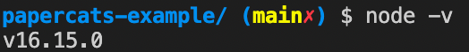

# Chapter 1

## Setting up your environment
This chapter will guide you through setting up your environment ready for development.  If you already have a recent version of `Node.js` installed then you can skip to last step this tutorial: _[Checking your environment](#checking-your-environment)_.

### Installing NVM
Throughout this guide we're going to be using `Node.js` and `npm`.  To install these we're going to use `nvm` or _Node.js version manager_.  `Nvm` abstracts a lot of the steps needed to manage different node versions on your computer and is often a recommended way to install node on a development machine (note: `nvm` is **not** recommended for production deployments).

Fortunately, `nvm` is widely used and has a comprehsive installation guide.  If you are a linux, mac or $WSL user, you can [follow these steps](https://github.com/nvm-sh/nvm#installation-and-update) to install `nvm`.  If you are a Windows user checkout this [guide here](https://github.com/coreybutler/nvm-windows#installation--upgrades).

### Installing node
We are going to assume you have `nvm` installed now. In your terminal window, node type the following:

```nvm install node && nvm use node```

This should install the latest version of node which we will verify in the next step.

### Checking your environment
In the same terminal window you installed `node` type the following:

```node -v```

You should get something like the following:



If you don't see the above or if your version is lower than 16.x then try installing the latest node version again.

If you see something similar to the image above, great! You are ready to start your first Web3 project.  [Go to Chapter 2](../chapter-2/).
