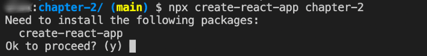

# Creating your Project
Welcome to Chapter 2!

In this chapter we are going to be walking through starting your project with the `create-react-app` toolchain.  This is perfect for creating a Single Page Application (SPA).

Before we start any coding, we are going to be using the `npx` or _node package executable_ command to run the `create-react-app` binary.  `Npx` is useful because it will also ask to install the package if it is missing from your system.  To read more about `npx`, [this article](https://medium.com/@maybekatz/introducing-npx-an-npm-package-runner-55f7d4bd282b) provides a nice primer into its role within the node ecosystem.

## Lets get started!
To start your project, open up a command line terminal and navigate to the location where you want to store this repository.  

In the command line type the following:

```npx create-react-app my-papercats-app```

What we are doing here is calling `npx` with two parameters, `create-react-app` (the excutable we want to run) and `my-papercats-app` the target folder of the `create-react-app` application.

If this is the first time you are running the `create-react-app` binary you may get the following message:



This is asking you to confirm to install this missing executable which we want to do, so press `Y` to continue.
