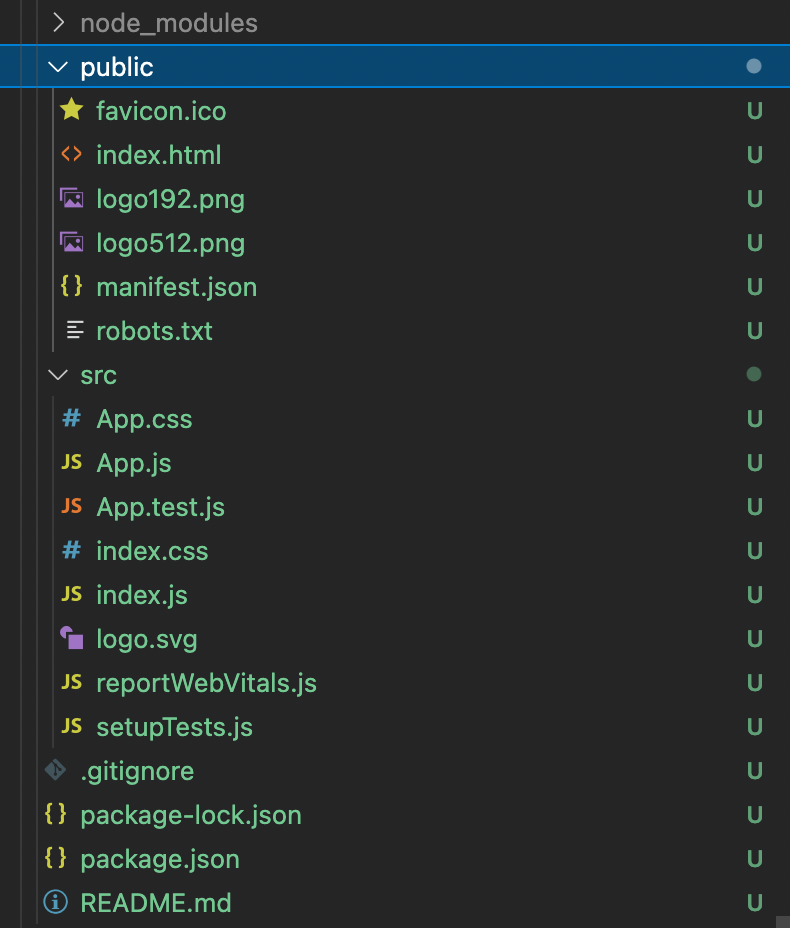
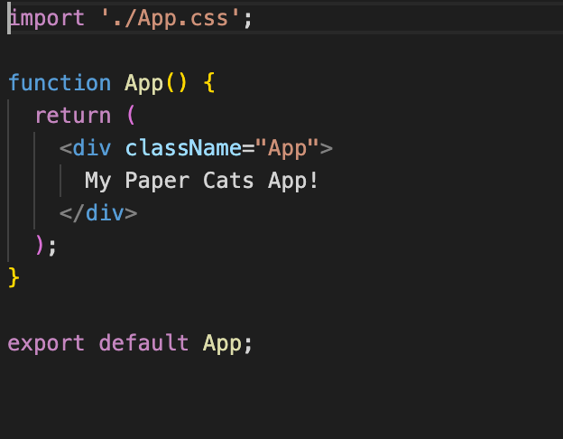
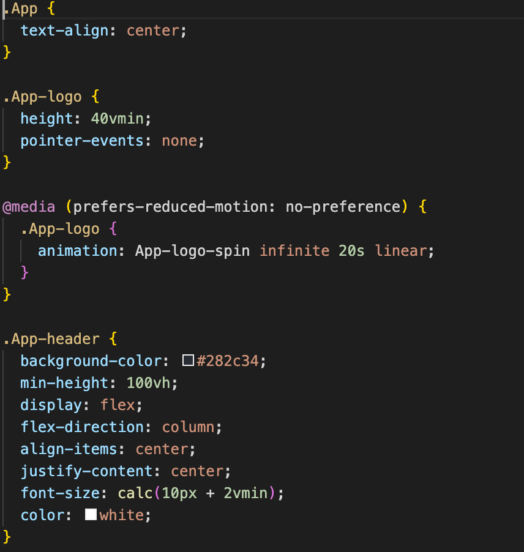
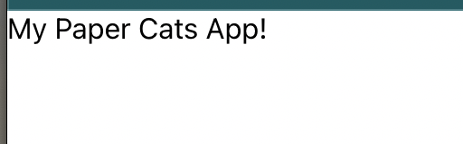

# Customising your project

Now that we have our react app initialised we are in a position to start customising it!  

## TLDR
In this chapter we are going to be modifying some of the default `create-react-app` components.  If you already know react, you can skip this chapter and move on to the [next](../chapter-4/).  If you just want to see a working example, [this is what we're going to produce](https://codesandbox.io/s/chapter-3-vanilla-react-js-6pt5mo).

## Components?
Your brand new react project folder should have the following contents:

After running `npm start` the React project encourages you to start editing the `src/App.js`, so lets start there.  Looking at the `src/App.js`, this is the code that is added by default by `create-react-app`:

What you see here is our `App` component with some html.  One thing to note is that although it looks like html, this code is actually [JSX](https://reactjs.org/docs/introducing-jsx.html).  To quote the react docs:

> It is called JSX, and it is a syntax extension to JavaScript. We recommend using it with React to describe what the UI should look like. JSX may remind you of a template language, but it comes with the full power of JavaScript.

Lets most of the default JSX and replace it with some simple text and save the file to this:

You will see in you're browser window that the code changes you make will immediately reflected on screen!  This is known as [Hot Module Replacement](https://webpack.js.org/concepts/hot-module-replacement/) and is provided by the [Webpack](https://webpack.js.org/) bundler that is used by `react-create-app`.

Whilst we're here, lets have a look at the `src/App.css` file too:

If we remove all of the code from `src/App.css` and save the file, we should see the following result!

Feel free to modify the `src/App.js` and `src/App.css` more and play around with live edits in your browser as thats is for this chapter.  Here we have learnt briefly about `JSX` and that making code edits will do a live reload of our site which should help speed up development time! 

## Whats next?
In [Chapter 4](../chapter-4) we'll start looking at adding a [new Web3 connect component](https://github.com/coolcatsnft/web3-widget) onto our site.
