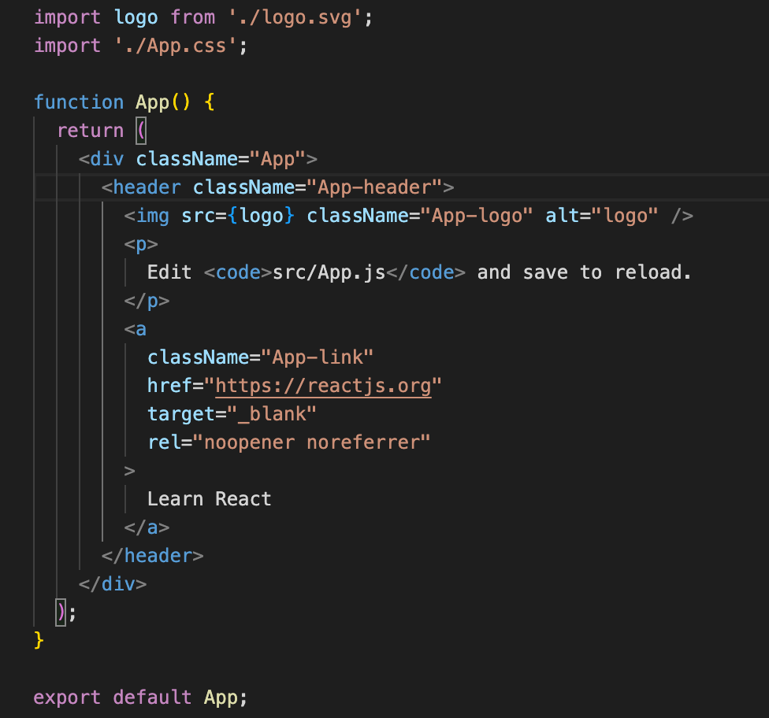

# Customising your project

Now that we have our react app initialised we are in a position to start customising it!  Your brand new react project folder should have the following contents:

After running `npm start` the React project encourages you to start editing the `src/App.js`, so lets start there.  Looking at the `src/App.js`, this is the code that is added by default by `create-react-app`:

Lets remove it and replace it with some simple text and save the file to this:

You will see in you're browser window that the code changes you make will immediately reflected on screen.  This is known as [Hot Module Replacement](https://webpack.js.org/concepts/hot-module-replacement/) and is provided by the [Webpack](https://webpack.js.org/) bundler that is used by `react-create-app`.

Whilst we're here, lets have a look at the `src/App.css` file too:

If we remove all of the code from `src/App.css` and save the file, we should see the following result!

Feel free to modify the `src/App.js` and `src/App.css` more and play around with live edits in your browser.  Thats is for this chapter.  Here we have learnt briefly about `JSX` and that making code edits will do a live reload of our site which should help speed up development time! 

In [Chapter 4](../chapter-4) we'll start looking at adding new Web3 connect component onto our site.
